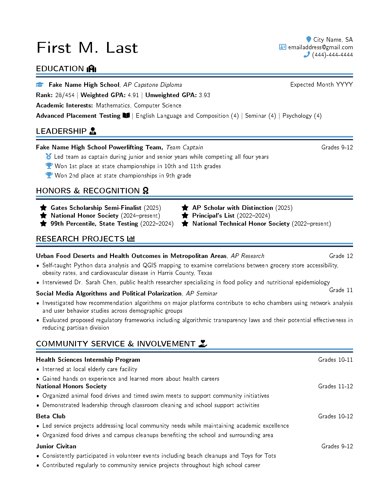

# Clean-LaTex-Resume-Template
# High School/College Resume LaTeX Template

A clean, modern, and ATS-friendly LaTeX resume template designed for high-achieving students applying to competitive colleges, scholarships (e.g., Gates Scholarship), internships, or early career opportunities in STEM, health sciences, or related fields. Originally created by a college student for their high school sister, this template emphasizes strong academics, research projects, leadership, and community service in a professional one-page format.

## Features
- Elegant double-line section headers with customizable primary and secondary colors
- Font Awesome icons for visual appeal (e.g., for education, awards, leadership)
- Two-column layout for dates and roles with clean alignment
- Fully ATS-parsable (machine-readable PDF output using `glyphtounicode`)
- Uses the modern Lato sans-serif font
- Single-page design optimized for brevity and impact
- Easy to customize – update content, colors, or add sections directly in the `.tex` file

## Preview
Here is an example render of the template in use:

- **Templated Version** (with placeholder data):  
    

Compiled PDF example: [ResumeTemplateExample.pdf](ResumeTemplateExample.pdf)  

## Why This Template?
This template was built to showcase:
- High class rank, weighted GPA, and AP achievements
- Advanced research projects (e.g., self-taught programming like R/Python, GIS tools, expert interviews)
- Leadership in athletics (e.g., state championships as team captain)
- Prestigious honors and consistent community involvement

It's ideal for students with quantitative/research experience who want a standout design that's professional yet approachable. The template is flexible for high school or early college use—simply swap in your details.

## Quick Start
1. Clone or download the repository.
2. Open `ResumeTemplate.tex` in your LaTeX editor (e.g., Overleaf, TeXShop, or VS Code with LaTeX extension).
3. Replace placeholders like "First M. Last", school names, dates, and descriptions with your own info.
4. Compile with PDFLaTeX: `pdflatex ResumeTemplate.tex` (or use the build script if you add one).
5. Output: A polished one-page PDF resume.

## Requirements
- PDFLaTeX (or XeLaTeX/LuaLaTeX for advanced users)
- Standard packages: geometry, fontawesome5, xcolor, hyperref, eso-pic, etc. (all available on CTAN or Overleaf)
- No additional installations needed beyond a basic TeX distribution (e.g., TeX Live or MiKTeX)

## Customization
The template is designed for easy modifications—everything is in `ResumeTemplate.tex`. Inline comments in the code guide you.

### Changing Colors
Colors are defined at the top of the `.tex` file for quick tweaks. The default scheme uses a blue primary for accents and a dark secondary for lines, but you can change them to match your style (e.g., school colors or a minimalist grayscale).

1. Locate these lines near the top:
2. Update the color codes:
- Use HTML hex codes (e.g., `{HTML}{FF0000}` for red) or RGB (e.g., `{RGB}{255,0,0}`).
- Examples:
  - For a green theme: `\definecolor{primaryColor}{HTML}{228B22}` (forest green) and `\definecolor{secondaryColor}{HTML}{006400}` (dark green).
  - For grayscale: `\definecolor{primaryColor}{HTML}{A9A9A9}` (dark gray) and `\definecolor{secondaryColor}{HTML}{696969}` (dim gray).
- Tools to pick colors: Use websites like [coolors.co](https://coolors.co) or [htmlcolorcodes.com](https://htmlcolorcodes.com) to find hex/RGB values.

3. Recompile the PDF to see changes. This affects section lines, icons, and hyperlinks.

### Other Customizations
- **Fonts**: Change `\usepackage{lato}` to another sans-serif font like `\usepackage{helvet}` for Helvetica.
- **Sections**: Add/remove sections by copying the `\sectiondoubleline{}` structure.
- **Icons**: Swap Font Awesome icons (e.g., `\faSchool` to `\faUniversity`)—see [Font Awesome docs](https://fontawesome.com/v5/cheatsheet) for codes.
- **Layout**: Adjust margins in `\usepackage[ ... ]{geometry}` or add new environments for multi-page if needed.
- Tip: Test ATS compatibility by uploading your PDF to tools like Jobscan or converting to text to ensure readability.

## License
MIT License – free to use, modify, and distribute. If you improve it, consider sharing back!

---
Created in 2025. If you have questions or suggestions, open an issue. Good luck with your applications—your sister's resume looks impressive!
